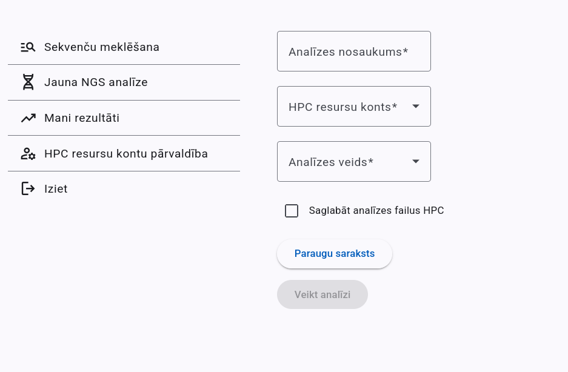

# Setup the demo version

1. launch mock services (needs [podman](https://podman.io/) to run):
```
bash launch_mock_services.sh
```

2. build backend (needs java 22):
```
cd backend/BioinformaticsPortal && ./mvnw clean install && java -jar target/BioinformaticsPortal-0.0.1-SNAPSHOT.jar
```

3. build frontend (needs [npm](https://www.npmjs.com/) and [ng](https://angular.dev/tools/cli/setup-local)):
```
cd frontend && npm install && ng serve
```

4. Open in browser [http://localhost:8081](http://localhost:8081) for keycloak. Username and password: `admin`.

5. Create new realm from `keycloak/realm-export.demo.json` file.

6. In the generated realm create new user with password and add it to `portal-admin` group.

7. Open in browser [http://localhost:4200](http://localhost:4200). You will be redirected to keycloak. Enter the credentials of the created user.

8. You should be logged in the portal and see the following page:


